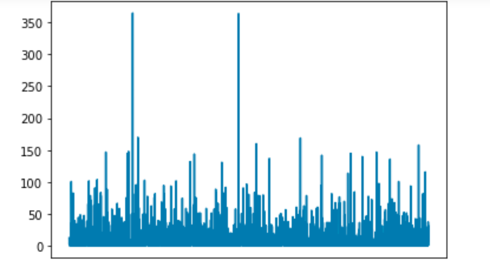

# Recommendations with IBM

## Table of Contents

  - [Description](#description)
  - [How to install the application?](#how-to-install-the-application)

## Description
I set up this project devoted to Data Scientist Nanodegree Program by Udacity. 

The project is composed six parts: 
- Exploratory Data Analysis
- Rank Based Recommendations
- User-User Based Collaborative Filtering
- Content Based Recommendations (EXTRA - NOT REQUIRED)
- Matrix Factorization
- Extras & Concluding

[Recommendations_with_IBM.html](Recommendations_with_IBM.html) is provided to summarized our experiment with [Recommendations_with_IBM.ipynb](Recommendations_with_IBM.ipynb)

## How to install the application? 

The project's development environment is as follows: 
* Ubuntu 18.04 LTS
* Python 3.6+
* [package_list.txt](package_list.txt) 
  
You can use `conda create --name your_env_name --file package_list.txt ` to install the Python libraries that the project depends on. After that, you can download the project's source code with GIT. 
